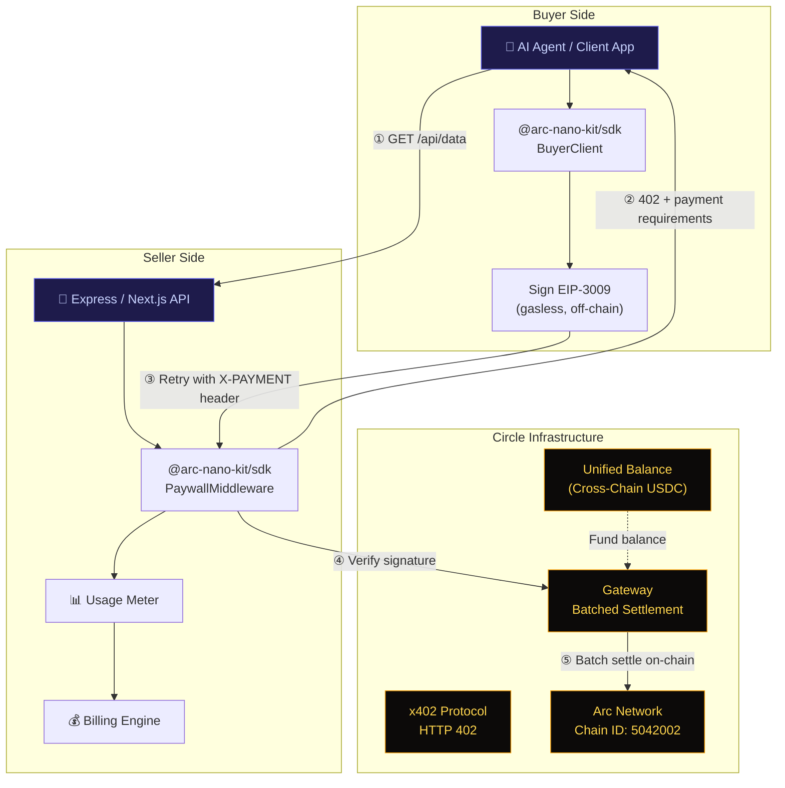

<p align="center">
  
  
  
  <a href="https://opensource.org/licenses/Apache-2.0"></a>
  <a href="https://arc-nano-kit-demo.vercel.app"></a>
  
</p>

<h1 align="center">arc-nano-kit</h1>

<p align="center">
  <strong>Open-source middleware that turns Circle Nanopayments into production-ready<br/>usage-based billing for APIs, AI agents, and data services on Arc.</strong>
</p>

<p align="center">
  <a href="#-quickstart">Quickstart</a> ·
  <a href="#-architecture">Architecture</a> ·
  <a href="#-features">Features</a> ·
  <a href="docs/getting-started.md">Documentation</a> ·
  <a href="ROADMAP.md">Roadmap</a> ·
  <a href="#-contributing">Contributing</a>
</p>

---

## The Problem

Circle has shipped powerful payment primitives — **Nanopayments**, **Gateway batched settlement**, and the **x402 protocol** — but there's no production-ready, Arc-first open-source package with great DX that lets builders go from `npm install` to a working paid API in minutes.

**arc-nano-kit bridges that gap.**

We turn these primitives from docs and quickstarts into **drop-in middleware** for Express, Next.js, and Fastify, complete with a billing engine, buyer SDK, and usage dashboard.

## ✨ Features

| Feature | Description | Status |
|---------|-------------|--------|
| **Paywall Middleware** | One-line Express/Next.js middleware for x402-protected endpoints | ✅ Ready |
| **CLI Generator** | Scaffold new paid APIs in 30 seconds via `npx create-arc-nano-kit` | ✅ Ready |
| **Buyer SDK** | TypeScript client with automatic `402 → sign → retry` flow | ✅ Ready |
| **Billing Engine** | Per-request, per-second, per-job pricing models | ✅ Ready |
| **Usage Metering** | Track consumption per buyer, per endpoint | ✅ Ready |
| **Gateway Client** | Unified balance monitoring, deposit tracking | ✅ Ready |
| **Demo App** | Next.js app with live paywalled API endpoints | ✅ Ready |
| **Dashboard** | Real-time analytics and revenue tracking | 🔜 Phase 2 |
| **Multi-Framework** | Fastify, Hono, Python, Go adapters | 🔜 Phase 3 |

## 🚀 Quickstart

### Scaffold a New Project (Recommended)

The fastest way to get started is with our interactive CLI:

```bash
npx create-arc-nano-kit
```

This will prompt you for your preferred framework (Express or Next.js) and pricing model, then generate a fully configured, ready-to-run project.

### Manual Setup

**Express.js** — 3 lines to add usage-based billing:

```typescript
import express from 'express';
import { expressPaywall } from '@arc-nano-kit/sdk/middleware';

const app = express();

app.get('/api/premium/data',
  expressPaywall({ price: '0.001', network: 'arc-testnet' }),
  (req, res) => {
    res.json({ data: 'This costs $0.001 USDC per request' });
  }
);
```

**Next.js App Router:**

```typescript
import { nextPaywall } from '@arc-nano-kit/sdk/middleware';

export const GET = nextPaywall(
  { price: '0.001', network: 'arc-testnet' },
  async (request) => {
    return Response.json({ data: 'Premium content' });
  }
);
```

### Buy Access to a Paywalled API

```typescript
import { BuyerClient } from '@arc-nano-kit/sdk/client';

const buyer = new BuyerClient({
  privateKey: process.env.BUYER_PRIVATE_KEY,
  rpcUrl: 'https://rpc.testnet.arc.network',
});

// Automatically handles 402 → sign EIP-3009 → retry
const response = await buyer.request('https://api.example.com/api/premium/data');
console.log(response.data);    // { data: 'Premium content' }
console.log(response.payment); // { amount: '0.001', network: 'arc-testnet' }
```

## 🏗️ Architecture



### Payment Flow

```
Buyer                     arc-nano-kit (Seller)           Circle Gateway
  │                              │                              │
  │─── GET /api/data ───────────►│                              │
  │                              │                              │
  │◄── 402 + requirements ──────│                              │
  │    (price, payTo, network)   │                              │
  │                              │                              │
  │ (sign EIP-3009 off-chain)    │                              │
  │                              │                              │
  │─── GET /api/data ───────────►│                              │
  │    + X-PAYMENT header        │                              │
  │                              │─── verify payment ──────────►│
  │                              │◄── valid ────────────────────│
  │                              │                              │
  │◄── 200 + data ──────────────│                              │
  │                              │     ... more requests ...    │
  │                              │                              │
  │                              │◄── batch settle on Arc ─────│
```

## 📦 Project Structure

```
arc-nano-kit/
├── packages/
│   └── sdk/                     # @arc-nano-kit/sdk
│       ├── src/
│       │   ├── middleware/       # Express & Next.js paywall middleware
│       │   ├── client/          # Buyer SDK (auto 402 flow)
│       │   ├── billing/         # Usage metering & pricing plans
│       │   ├── gateway/         # Circle Gateway client
│       │   ├── types.ts         # Shared TypeScript types
│       │   └── constants.ts     # Arc chain config
│       └── package.json
├── apps/
│   └── demo/                    # Next.js demo app
│       ├── src/app/
│       │   ├── page.tsx         # Landing page
│       │   └── api/             # Paywalled endpoints
│       └── package.json
├── docs/                        # Documentation
│   ├── architecture.md
│   ├── getting-started.md
│   └── why-arc.md
├── ROADMAP.md
├── SECURITY.md
├── CONTRIBUTING.md
└── CHANGELOG.md
```

## 🔧 SDK Modules

### Middleware (`@arc-nano-kit/sdk/middleware`)

Framework adapters that gate your endpoints behind x402 paywalls:

```typescript
import { expressPaywall } from '@arc-nano-kit/sdk/middleware';
import { nextPaywall } from '@arc-nano-kit/sdk/middleware';
import { createPaywallMiddleware } from '@arc-nano-kit/sdk/middleware';
```

### Client (`@arc-nano-kit/sdk/client`)

Buyer SDK for consuming paywalled APIs — handles the full 402 flow:

```typescript
import { BuyerClient } from '@arc-nano-kit/sdk/client';
```

### Billing (`@arc-nano-kit/sdk/billing`)

Flexible pricing models and usage tracking:

```typescript
import { createBillingPlan, UsageMeter } from '@arc-nano-kit/sdk/billing';

// Per-request: $0.001 per API call
const apiPlan = createBillingPlan({
  name: 'API Standard',
  pricing: { model: 'per-request', pricePerRequest: '0.001' },
});

// Per-second: $0.01/s for streaming compute
const computePlan = createBillingPlan({
  name: 'Compute',
  pricing: { model: 'per-second', pricePerSecond: '0.01' },
});

// Per-job: $0.50 base + $0.001/MB
const batchPlan = createBillingPlan({
  name: 'Batch Processing',
  pricing: { model: 'per-job', basePrice: '0.50', pricePerUnit: '0.001', unitName: 'MB' },
});
```

### Gateway (`@arc-nano-kit/sdk/gateway`)

Circle Gateway unified balance management:

```typescript
import { GatewayClient } from '@arc-nano-kit/sdk/gateway';

const gateway = new GatewayClient({
  walletAddress: '0x...',
  rpcUrl: 'https://rpc.testnet.arc.network',
});

const balance = await gateway.getBalance();
console.log(`Balance: ${balance.available} USDC`);
```

## 🌐 Why Arc?

Arc is Circle's Layer 1 blockchain — purpose-built for stablecoin-native finance. Here's why it's the ideal foundation for usage-based billing:

| Feature | Arc | Ethereum | Base | Solana |
|---------|-----|----------|------|--------|
| **Gas Token** | USDC | ETH | ETH | SOL |
| **Finality** | <1s deterministic | ~12min | ~2s | ~0.4s |
| **Min Payment** | $0.000001 | ~$0.50 | ~$0.001 | ~$0.001 |
| **Gas per Tx** | ~$0.001 | ~$1-50 | ~$0.01 | ~$0.0001 |
| **USDC Native** | ✅ | ❌ | ❌ | ❌ |
| **Nanopayments** | Native | Via L2 | Via x402 | Via x402 |

**Key advantages:**
- **USDC as gas** — No volatile assets needed. Dollar-denominated, predictable costs.
- **Sub-second finality** — Malachite BFT consensus. Deterministic, no reorgs.
- **Nanopayments** — Gasless payments as small as $0.000001 via Gateway batched settlement.
- **Agent-first** — Built for autonomous AI agents with policy-controlled wallets and x402.

## 🔗 Circle Integrations

arc-nano-kit leverages the full Circle stack:

| Integration | Package | Usage |
|-------------|---------|-------|
| **Nanopayments** | `@circle-fin/x402-batching` | Gasless off-chain payment signing & batch settlement |
| **x402 Protocol** | `@x402/core`, `@x402/evm` | HTTP 402 payment standard implementation |
| **Gateway** | `@circle-fin/unified-balance-kit` | Cross-chain unified USDC balance |
| **App Kit** | `@circle-fin/app-kit` | Bridge, swap, and monetization features |
| **Arc Network** | `viem` | EVM-compatible chain interaction (Chain ID: 5042002) |

## 📊 Comparison with Official Sample Apps

| Feature | `arc-nanopayments` | **arc-nano-kit** |
|---------|-------------------|------------------|
| **Scope** | Reference demo | Production middleware |
| **Reusability** | Fork & modify | `npm install` & configure |
| **Middleware** | Built-in to demo | Framework-agnostic, pluggable |
| **Buyer SDK** | LangChain agent | Standalone TypeScript client |
| **Billing** | None | Per-request / per-second / per-job |
| **Usage Tracking** | None | Built-in metering & analytics |
| **Multi-Framework** | Next.js only | Express, Next.js, Fastify (planned) |
| **Target** | Developers learning | Developers shipping |

> `arc-nanopayments` is Circle's excellent reference implementation. arc-nano-kit builds on the same primitives to provide a **production-ready SDK** that developers can integrate into their own applications.

## 🛡️ Arc Network Details

| Parameter | Value |
|-----------|-------|
| Network | Arc Testnet |
| Chain ID | `5042002` |
| RPC URL | `https://rpc.testnet.arc.network` |
| Block Explorer | [testnet.arcscan.app](https://testnet.arcscan.app) |
| Faucet | [faucet.circle.com](https://faucet.circle.com) |
| Gas Token | USDC |
| Consensus | Malachite BFT (<1s finality) |
| CCTP Domain | 26 |
| Mainnet ETA | Summer 2026 |

## 🗺️ Roadmap

| Phase | Timeline | Key Deliverables | Status |
|-------|----------|------------------|--------|
| **Foundation** | Weeks 1-2 | SDK middleware, buyer client, billing engine, demo app | ✅ In Progress |
| **Production** | Weeks 3-4 | Usage dashboard, Gateway helpers, CLI scaffolding | 🔜 Next |
| **Ecosystem** | Months 2-3 | Multi-framework, agent commerce, Arc Mainnet | 📋 Planned |

See [ROADMAP.md](ROADMAP.md) for the detailed feature roadmap.

## 🤝 Contributing

We welcome contributions from the community! See [CONTRIBUTING.md](CONTRIBUTING.md) for guidelines.

```bash
# Development setup
git clone https://github.com/horn111/arc-nano-kit.git
cd arc-nano-kit
npm install
npm run dev
```

## 🔒 Security

For security concerns, please see [SECURITY.md](SECURITY.md). Do **not** report security vulnerabilities through public GitHub issues.

## 📄 License

This project is licensed under the [Apache License 2.0](LICENSE) — the same license used by Circle's official open-source projects.

---

<p align="center">
  <strong>Built on <a href="https://arc.network">Arc</a> · Powered by <a href="https://developers.circle.com">Circle</a> · Protocol: <a href="https://x402.org">x402</a></strong>
</p>

<p align="center">
  <sub>
    arc-nano-kit is an independent open-source project and is not officially affiliated with Circle Internet Financial.
    <br/>
    Circle, USDC, and Arc are trademarks of Circle Internet Financial, LLC.
  </sub>
</p>
