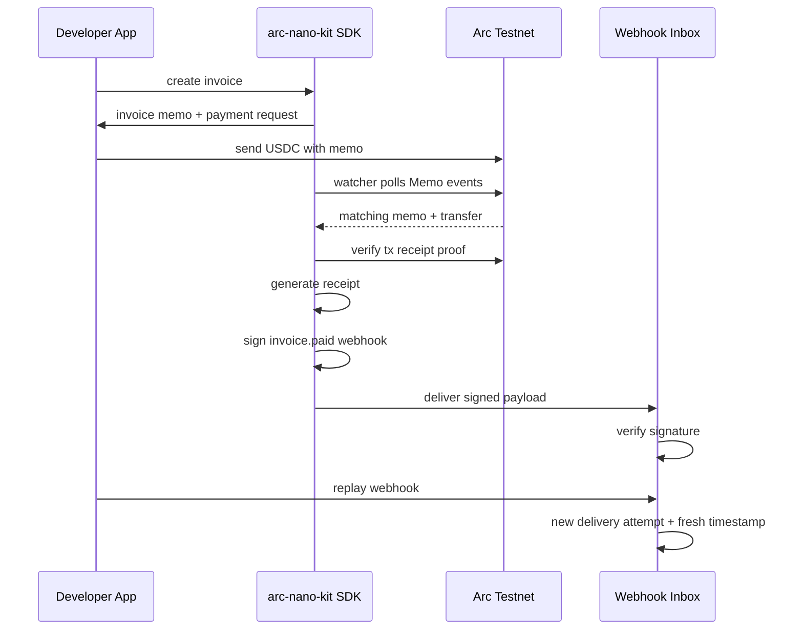

<p align="center">
  
  
  
  <a href="https://opensource.org/licenses/Apache-2.0"></a>
  
</p>

<h1 align="center">arc-nano-kit</h1>

<p align="center">
  <strong>Open-source payment operations toolkit for Arc builders.</strong>
  <br />
  Paid APIs, invoices, transaction memos, receipts, watcher proof polling, signed webhooks, and local delivery replay.
</p>

<p align="center">
  <a href="#why-this-exists">Why</a> ·
  <a href="#what-works-today">What Works</a> ·
  <a href="#arc-receipts">Arc Receipts</a> ·
  <a href="#quickstart">Quickstart</a> ·
  <a href="docs/grant.md">Grant Snapshot</a> ·
  <a href="docs/demo-script.md">Demo Script</a> ·
  <a href="docs/receipts.md">Receipts Docs</a> ·
  <a href="ROADMAP.md">Roadmap</a>
</p>

---

## Why This Exists

Arc is built for stablecoin-native financial applications: predictable USDC-denominated fees, fast deterministic settlement, and direct access to Circle's developer stack.

That creates a strong base layer, but application developers still need the operational layer around payments:

- pricing and paid API gates
- invoice IDs
- transaction memos
- receipt generation
- webhook signing
- webhook verification
- replayable delivery attempts
- local reconciliation during development

`arc-nano-kit` is focused on that application layer. The current product direction is intentionally narrow: make Arc payments feel operable for developers building APIs, agents, and stablecoin-native apps.

## Grant Snapshot

`arc-nano-kit` is a TypeScript monorepo with:

- `@arc-nano-kit/sdk` for middleware, buyer flows, billing, receipts, watcher logic, and webhook delivery helpers.
- `create-arc-nano-kit` for scaffolding a paid API project from this repo.
- `apps/demo` for a local Next.js demo of paywalled endpoints and Arc Receipts payment ops.
- Documentation for the grant snapshot, local demo script, getting started, architecture, Arc rationale, and the receipts module.

The newest shipped path is:

```text
create invoice
build Arc transaction memo payment request
watch Arc Testnet memo-wrapped USDC payment
generate receipt
optionally auto-watch or verify a real Arc Testnet tx proof
create signed invoice.paid webhook
deliver webhook into local inbox
verify SDK signature
replay webhook with a fresh timestamp
```

This is not a hosted dashboard or production queue yet. It is a developer-facing local payment ops kit that proves the core workflow end to end.

## What Works Today

| Area | Status | Notes |
|------|--------|-------|
| Express paywall middleware | Ready | Returns x402-style `402 Payment Required` responses and validates payment payloads. |
| Next.js Route Handler adapter | Ready | Wraps App Router route handlers with the same paywall flow. |
| Buyer SDK | Ready | Handles `402 -> sign -> retry` for EIP-3009-style payments. |
| Billing engine | Ready | Per-request, per-second, and per-job pricing helpers. |
| Usage metering | Ready | In-memory usage records and summaries. |
| CLI scaffolder | Ready in repo | `packages/create-arc-nano-kit` generates Express or Next.js paid API starters. |
| Arc Receipts | Ready | Invoices, memos, receipts, signed webhook events, and in-memory ledger. |
| Arc Testnet watcher | Ready | Watches memo-wrapped USDC payments and records matching receipts locally. |
| Arc Testnet proof mode | Ready | Polls Memo logs or verifies a pasted tx hash against a memo payment request and returns block/log proof. |
| Webhook Inbox + Replay | Ready | Verifies signed webhook delivery attempts and replays events locally. |
| Demo app | Ready locally | Next.js demo with paid endpoints, watcher flow, onchain proof, inbox verification, and replay. |
| Persistent receipt store | Planned | SQLite/Postgres adapter is a next-step production feature. |
| Hosted dashboard | Planned | Analytics UI and managed ops surface are not part of the current MVP. |
| Fastify/Hono/Python/Go adapters | Planned | Current framework adapters are Express and Next.js. |

## Arc Receipts

Arc Receipts is the main module in the current roadmap. It turns raw stablecoin payments into app-level payment operations.

### The Problem

A transfer is not enough for most apps. Builders need to know:

- Which invoice was paid?
- Which transaction memo connected the payment to app state?
- Was the payment amount sufficient?
- Which receipt should be stored?
- Which webhook was sent?
- Did the app verify the signature?
- Can the webhook delivery be replayed during development?

### The Local Flow



### What This Proves

The demo does not stop at "webhook ready". It shows verified delivery:

- `receipt.generated`
- optional `onchainProof` with tx hash, block, memo/log index, and Arcscan link
- raw webhook payload
- `x-arc-signature`
- SDK verification
- delivery attempt `#1`
- replayed delivery attempt `#2`
- new `t=<timestamp>,v1=<hmac>` signature header

## Quickstart

### Install

```bash
npm install @arc-nano-kit/sdk
```

### Express Paid Endpoint

```typescript
import express from 'express';
import { expressPaywall } from '@arc-nano-kit/sdk/middleware';

const app = express();

app.get(
  '/api/premium/data',
  expressPaywall({
    price: '0.001',
    network: 'arc-testnet',
    payTo: '0x1111111111111111111111111111111111111111',
  }),
  (_req, res) => {
    res.json({ data: 'This costs 0.001 USDC per request' });
  },
);

app.listen(3000);
```

### Next.js Route Handler

```typescript
import { nextPaywall } from '@arc-nano-kit/sdk/middleware';

export const GET = nextPaywall(
  {
    price: '0.001',
    network: 'arc-testnet',
    payTo: '0x1111111111111111111111111111111111111111',
  },
  async () => {
    return Response.json({ data: 'Premium content' });
  },
);
```

### Buyer Client

```typescript
import { BuyerClient } from '@arc-nano-kit/sdk/client';

const buyer = new BuyerClient({
  privateKey: process.env.BUYER_PRIVATE_KEY as `0x${string}`,
  rpcUrl: 'https://rpc.testnet.arc.network',
});

const response = await buyer.request('https://api.example.com/api/premium/data');

console.log(response.data);
console.log(response.payment);
```

### Invoice, Receipt, and Signed Webhook

```typescript
import {
  ReceiptLedger,
  signWebhookEvent,
} from '@arc-nano-kit/sdk/receipts';

const ledger = new ReceiptLedger();

const invoice = ledger.createInvoice({
  id: 'inv_pro_plan_123',
  amount: '19.00',
  currency: 'USDC',
  payTo: '0x1111111111111111111111111111111111111111',
  description: 'Pro plan subscription',
});

const receipt = ledger.recordPayment(invoice.id, {
  from: '0x2222222222222222222222222222222222222222',
  to: invoice.payTo,
  amount: '19.00',
  memo: invoice.memo,
  txHash: '0xabc' as `0x${string}`,
});

const paidEvent = ledger.listWebhookEvents().at(-1)!;
const signature = signWebhookEvent(paidEvent, process.env.ARC_WEBHOOK_SECRET!);

console.log(invoice.memo);      // arc-nano-kit:invoice:v1:inv_pro_plan_123
console.log(receipt.status);    // paid
console.log(signature.header);  // t=...,v1=...
```

### Webhook Inbox + Replay

```typescript
import {
  WebhookInbox,
  serializeWebhookPayload,
  signWebhookEvent,
} from '@arc-nano-kit/sdk/receipts';

const inbox = new WebhookInbox();
const event = ledger.listWebhookEvents().at(-1)!;
const signed = signWebhookEvent(event, process.env.ARC_WEBHOOK_SECRET!);

const delivery = inbox.receive({
  payload: serializeWebhookPayload(event),
  header: signed.header,
  secret: process.env.ARC_WEBHOOK_SECRET!,
  target: 'https://seller.app/webhooks/arc',
});

const replay = inbox.replay({
  event,
  secret: process.env.ARC_WEBHOOK_SECRET!,
  replayOf: delivery.id,
});

console.log(delivery.status); // verified
console.log(replay.attempt);  // 2
```

## Running The Demo

```bash
git clone https://github.com/horn111/arc-nano-kit.git
cd arc-nano-kit
npm install
npm run dev
```

Open [http://localhost:3000](http://localhost:3000).

The demo includes:

- paywalled API endpoint probes
- invoice and memo payment data
- Arc Testnet watcher flow simulation/API
- generated receipt JSON
- signed webhook payload
- local Webhook Inbox verification
- replayed webhook delivery attempt

## CLI Scaffolder

The repo includes a scaffolder package:

```bash
npm run build --workspace=packages/create-arc-nano-kit
node packages/create-arc-nano-kit/dist/index.js my-paid-api
```

It can generate Express or Next.js starters with a paid API route and environment template.

## SDK Modules

### Middleware

```typescript
import {
  createPaywallMiddleware,
  expressPaywall,
  nextPaywall,
} from '@arc-nano-kit/sdk/middleware';
```

The default verifier checks payment payload structure, amount, recipient, and expiry. Production integrations can provide a custom `verifyPayment` function to delegate verification to the appropriate payment infrastructure.

### Client

```typescript
import { BuyerClient } from '@arc-nano-kit/sdk/client';
```

The buyer client signs an authorization and retries the original request with an `x-payment` header after receiving a `402 Payment Required` response.

### Billing

```typescript
import { UsageMeter, createBillingPlan } from '@arc-nano-kit/sdk/billing';
```

Billing helpers support:

- per-request pricing
- per-second pricing
- per-job pricing
- in-memory usage summaries

### Gateway / Balance Helpers

```typescript
import { GatewayClient } from '@arc-nano-kit/sdk/gateway';
```

The current Gateway client is intentionally small: it checks Arc Testnet native USDC balance, formats explorer links, and provides sufficient-balance checks. Deposit tracking, pending settlement state, and alerts are planned.

### Receipts

```typescript
import {
  ArcReceiptWatcher,
  ReceiptLedger,
  WebhookInbox,
  createInvoiceMemo,
  createMemoPaymentRequest,
  signWebhookEvent,
  verifyMemoPaymentProof,
  verifyWebhookSignature,
} from '@arc-nano-kit/sdk/receipts';
```

Receipts are the strongest current module and the center of near-term development.

## Project Structure

```text
arc-nano-kit/
├── apps/
│   └── demo/
│       ├── src/app/page.tsx
│       └── src/app/api/
│           ├── joke/
│           ├── weather/
│           ├── receipts/
│           └── webhook-inbox/
├── packages/
│   ├── sdk/
│   │   └── src/
│   │       ├── billing/
│   │       ├── client/
│   │       ├── gateway/
│   │       ├── middleware/
│   │       └── receipts/
│   └── create-arc-nano-kit/
│       └── src/
├── docs/
│   ├── architecture.md
│   ├── demo-script.md
│   ├── grant.md
│   ├── getting-started.md
│   ├── receipts.md
│   └── why-arc.md
├── ROADMAP.md
└── CHANGELOG.md
```

## Why Arc

Arc is a stablecoin-native Layer 1 from Circle, currently live on public testnet. It is designed around real-world financial flows: predictable dollar-based transaction costs, deterministic finality, and integration with Circle infrastructure such as USDC, CCTP, and Gateway.

That makes Arc a natural environment for:

- paid APIs
- autonomous agent payments
- usage-based billing
- stablecoin receipts
- application-level reconciliation
- payment operations that need fast settlement and predictable costs

`arc-nano-kit` focuses on the developer tooling around those workflows.

## Current Limits

This repo is still early. The current implementation is useful for local development, demos, and SDK iteration, but several production pieces are intentionally not finished yet:

- no persistent receipt database
- no persistent watcher cursor
- no hosted dashboard
- no managed webhook queue
- no Fastify/Hono/Python/Go adapters yet
- no default production Gateway verification path without a custom verifier
- refund and partial refund accounting are planned, not shipped

## Roadmap

### Shipped

- Express and Next.js paywall middleware
- Buyer SDK
- billing plans and usage metering
- invoice and transaction memo helpers
- Arc Testnet receipt watcher
- signed webhook helpers
- local Webhook Inbox + Replay
- local Next.js demo
- repo-local CLI scaffolder

### Next

- persistent receipt store
- persistent watcher cursor
- Next.js webhook route helpers
- refund and partial refund states
- stronger Gateway readiness helpers
- cleaner hosted demo flow

### Later

- dashboard and analytics
- Fastify and Hono adapters
- Python and Go SDKs
- hosted payment ops surface
- agent commerce workflows

## Development

```bash
npm install
npm run typecheck
npm run test --workspaces --if-present -- --reporter=dot
npm run dev
```

## Contributing

Contributions are welcome. See [CONTRIBUTING.md](CONTRIBUTING.md).

## Security

For security concerns, see [SECURITY.md](SECURITY.md). Do not report security vulnerabilities through public GitHub issues.

## License

Apache-2.0. See [LICENSE](LICENSE).

---

<p align="center">
  <strong>Built for <a href="https://www.arc.io">Arc</a> · Powered by <a href="https://developers.circle.com">Circle</a> primitives · Compatible with <a href="https://x402.org">x402</a> payment flows</strong>
</p>

<p align="center">
  <sub>
    arc-nano-kit is an independent open-source project and is not officially affiliated with Circle Internet Financial.
    <br />
    Circle, USDC, and Arc are trademarks of Circle Internet Financial, LLC.
  </sub>
</p>
