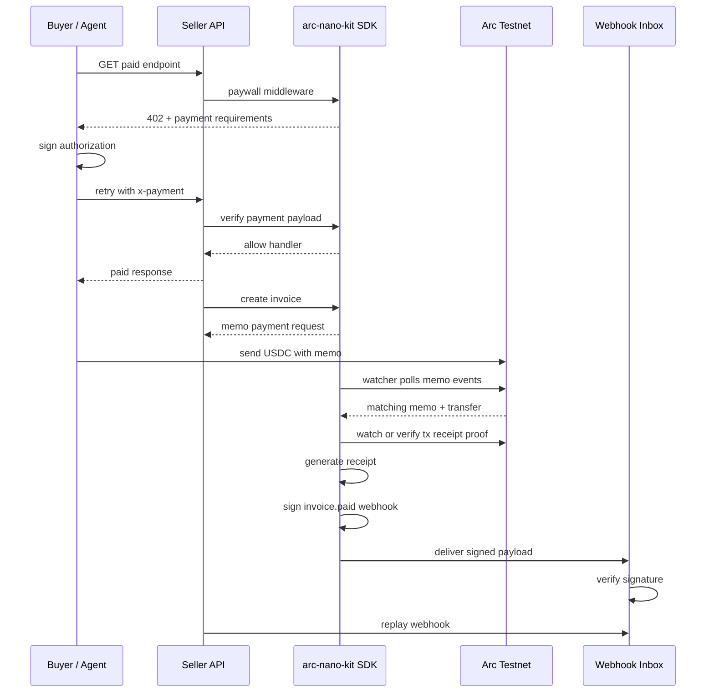

# Architecture

`arc-nano-kit` is a local-first payment operations toolkit for Arc builders. It sits between an application and payment infrastructure, giving developers reusable SDK pieces for paid APIs, billing, receipts, watchers, and signed webhook delivery.

## Current System Shape

```text
Developer app
  |
  |-- Express / Next.js API routes
  |     |
  |     |-- @arc-nano-kit/sdk/middleware
  |     |     - 402 Payment Required responses
  |     |     - payment header parsing
  |     |     - default structural verification
  |     |     - optional app-provided verifier
  |     |
  |     |-- @arc-nano-kit/sdk/billing
  |     |     - per-request pricing
  |     |     - per-second pricing
  |     |     - per-job pricing
  |     |     - in-memory usage records
  |     |
  |     |-- @arc-nano-kit/sdk/receipts
  |           - invoices
  |           - transaction memos
  |           - receipt matching
  |           - Arc Testnet watcher
  |           - read-only Arc Testnet proof polling
  |           - signed webhook events
  |           - local webhook inbox
  |           - replayable delivery attempts
  |
  |-- @arc-nano-kit/sdk/client
        - buyer-side 402 -> sign -> retry flow
```

## Payment Ops Flow



## Module Responsibilities

### Middleware

Current adapters:

- `expressPaywall()`
- `nextPaywall()`
- `createPaywallMiddleware()`

The default middleware verifier is intentionally small. It validates payment payload shape, amount, recipient, and expiry. Production apps can pass a custom `verifyPayment` function to delegate verification to their own payment infrastructure.

### Buyer Client

`BuyerClient` handles the client-side flow:

```text
request endpoint
-> receive 402 requirements
-> sign payment authorization
-> retry with x-payment header
-> return response and payment metadata
```

### Billing

Billing helpers model local pricing and usage state:

- per-request pricing;
- per-second pricing;
- per-job pricing;
- in-memory usage metering.

Persistent usage storage is planned, not shipped.

### Receipts

Receipts are the strongest current module. They cover:

- invoice creation;
- memo construction;
- memo payment request data;
- matching observed payments to invoices;
- read-only Arc Testnet proof polling and tx proof;
- local receipt generation;
- signed webhook events;
- local webhook inbox verification;
- replayable delivery attempts.

### Watcher

`ArcReceiptWatcher` is local-first and polling-based. It watches Arc Testnet memo-wrapped USDC payment shape, matches observed payments to invoices, attaches onchain proof data, and records receipts in the local ledger. `findMemoPaymentProof()` exposes the same read-only Memo-log lookup for a single payment request when a demo or app wants proof to fill in automatically.

Current limits:

- no persistent watcher cursor;
- no hosted indexer;
- no persisted proof polling cursor;
- no database-backed receipt store;
- no transaction broadcasting in proof mode;
- no refund state in the current watcher flow.

### Gateway / Balance Helpers

`GatewayClient` is currently a small balance helper. It can read Arc Testnet native USDC balance, format explorer links, and check sufficient balance.

It does not yet provide deposit tracking, pending settlement state, withdrawal automation, or alerting.

## Demo Architecture

The local Next.js demo contains:

- `/api/joke` and `/api/weather` paywalled endpoint probes;
- `/api/receipts` for the receipt and watcher demo payload;
- `/api/receipts/proof` for read-only Arc Testnet tx proof verification;
- `/api/receipts/proof/watch` for read-only Arc Testnet Memo-log proof polling;
- `/api/webhook-inbox` for raw signed webhook delivery verification;
- `/api/webhook-inbox/replay` for replaying the same webhook event with a fresh signature timestamp;
- `page.tsx` for the interactive local payment ops walkthrough.

The demo is designed to prove the developer workflow locally. It is not a production dashboard.

## Planned Extensions

The next architecture step is persistence:

```text
in-memory ledger
-> SQLite/Postgres receipt store
-> persistent watcher cursor
-> Next.js webhook route helper
-> refund and partial refund states
```

Later extensions may include dashboard analytics, additional framework adapters, and hosted payment operations surfaces.
